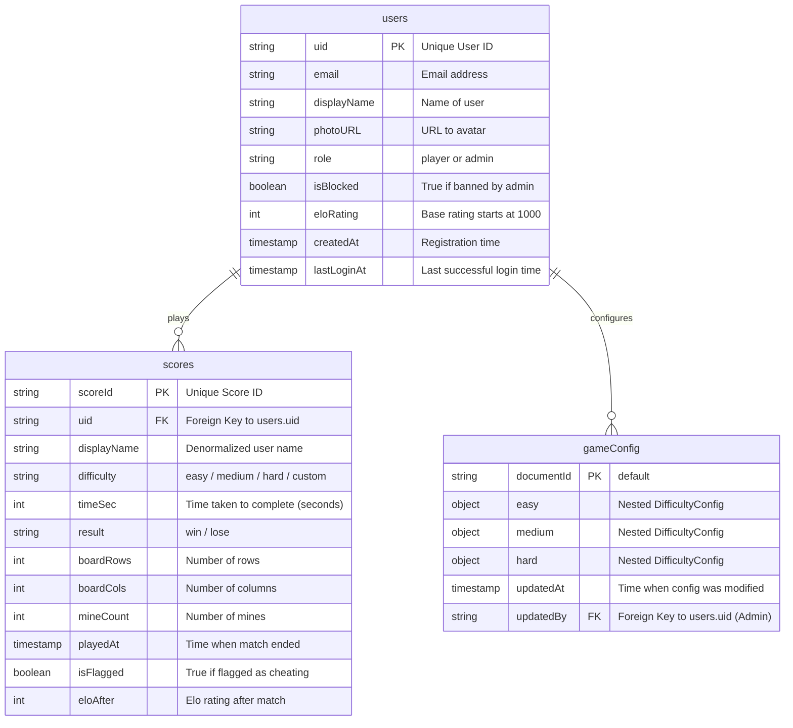

# Minesweeper Project - Entity Relationship Diagram (Mermaid)

Here is the Mermaid code for the ERD of the database schema (Firestore collections: `users`, `scores`, `gameConfig`).

## How to use

Copy the code block above and paste it into any Mermaid-compatible parser (like GitHub markdown, Notion, or [Mermaid Live Editor](https://mermaid.live)).
